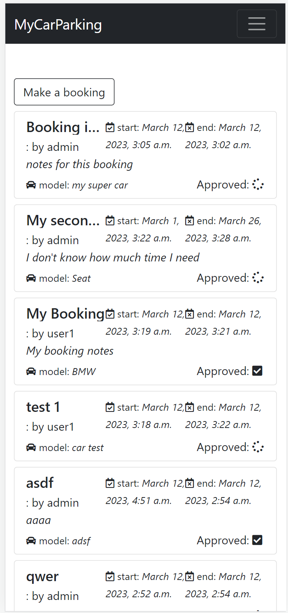
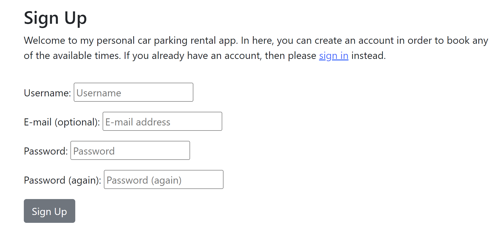

# CAR PARKING BOOKING APP

As my fourth project with Code Institute, I've decided to implement a website in Django, where users will be able to make reservations in my private car parking space. The main idea for this project is to create a website where I can manage the renting of my private car space (while I'm not using it), allowing people to use it for a couple of hours, days, or weeks. The pourpose of this website would be to post it on other blogs, websites,... give information of the location and prices, and then control the bookings by myself on this app.

- 
- 

Users can registers in order to view and make a booking. When the user is logged in, he can see all the bookings from all the users on the list. By clicking on the creation button, a new booking can be created by the user who is logged in.

# Table of Contents

- [Agile Workflow - User Stories](#agile-workflow)
- [Features](#features)
- [Future features](#future-features)
- [Design](#design)
    - [Wireframes](#wireframes)
    - [Typography and color scheme](#typography-and-color-scheme)
    - [Database](#database)
- [Technologies](#technologies)
- [Testing](#testing)
- [Deployment](#deployment)
- [Credits](#credits)

## Agile Workflow - User Stories

To this project, I've used an agile methodology in order to organize and prioritize the development tasks. Some User Stories have been created on the Github dashboard.

### User Stories

- Manage booking: As a Site Admin I can create, read, update and delete booking so that I can manage my car space bookings.
- Create booking form: As a Site User I can create a new booking on a form so that I can request a booking to the admin.
- Approve bookings: As a Site Admin I can approve or disapprove bookings so that I can say to users that date is accepted.
- View booking list: As a Site User I can view a list of bookings so that I can see when I can't book.
- Site pagination: As a Site User I can paginate the booking list so that see a list of all the bookings
- Registration: As a Site User I can register an account so that I can book any available date
- Open a booking: As a Site User I can click on a book so that I can read booking information

## Features

- __Navigation Bar__

The navigation bar was implemented with bootstrap. It is fixed on the top and contains four buttons that are shown or hidden as appropiate, the app name fixed on the left and the user name fixed on the right (displayed if logged in)

The button home is always on the bar: if the user is logged in it will shown the home page. Otherwise, I'll shown the welcome page

If the user is logged in, the logout button will be shown. This button redirects the user to the logout page.

If the user is not logged in, the register and login button will be shown, both redirect to the corresponding form.

- __Home Page__

This is the main page, where all the bookings are listed and are visible once the user is logged in, and where a new booking can be created by clicking on the "Make a booking" button.

Each row on the list is a different booking and each of them contain:
- The title of the reservation.
- The user name who creates the reservation.
- Optional notes that can be added on the reservation
- The car model.
- The requested start date and time.
- The requested end date and time.
- The status of the booking. If it's been approved or not.

If the list has more than 6 elements, "Next" and "Prev" buttons are displayed in order to navigate for all the rows.

- __Footer__

Only my name and email are shown in the footer.

- __Welcome page__

If users haven't logged in, a welcome page is shown, inviting them to login or register on the website.

- __Creation booking Form__

Users will be able to request a booking by clickin on the "Make a booking" button from the home page. This button will redirect the users to another page with the following form to fill out:

The form contains five required fields to fill out:
- The booking name: a title to give to the booking.
- Any note about the booking.
- The car model.
- The start date and time on which the user wants to leave the car.
- The end date and time on which the user wants to pick up the car.

By clicking on the submit button the booking is requested and a success meesage will be shown.

- __Register__

All users must register theirselver in order to see and create bookings. They can do it by clicking on the "Register" button on the navigation bar or clicking on the "sign_up" link in the welcome page.

- __Login__

Once the users has an account for the website, the can access by clicking on the login button on the navigation bar.

Users that are logged in can view the bookings and create new ones.

Only the admin user can delete or edit them from the admin panel. The admin approves the requests by changing the correponding field in the panel.

- __Logout__

Users can log out from the website by clicking on the logout button on the navigation bar.

## Future features

- USER STORY: Open a booking.
- When creating a new booking, users can only choose a date that hasn't been taken by others.
- Add an email field in order to send notifications to the users when the picked date is approved.

## Future features

### Wireframes

These wireframes were done in [Moqups](https://app.moqups.com/).

### Typography and colour scheme

- __Colour scheme__

The palette colour used for the website was based on the dark mode. Basically only whites, blacks and greys colours have been used. In terms of the Bootstrap component the dark theme has been also used. And for the buttons for example, the "secondary" and the "dark" color are the ones used.

- __Typography__

I have used font-family Roboto, family Lato, sans-serif 300 and 700. Since this fonts, from my point of view, are easy to read.

### Database

To create the database model diagrams I've also used the [Moqups](https://app.moqups.com/) website.

The user Table/class is given by Django by default. With this class we represent the users that are registered in our Database, and basically with two main fields: username and password.

On the other hand, the table Booking has been implemented for this project and represents each of the bookings created by the users. 
In this case, each booking benlogs to an User, that's why "user_id" is the foreign key in this table.
Other than that, the other fields added to this table are:
- booking_name: the title for the booking.
- notes: extra notes added by the user.
- car_model: the model of the car.
- approved: if I have approved the request or not.
- created_on: when it was created.
- updated_on: when it was updated.
- start_booking_date: the date the user wants to leave the car.
- end_booking_date: the date the user wants to pick up the car.

## Technologies

- Languages used: HTML5, CSS3, JavaScript, Python
- [Django:](https://www.djangoproject.com/) Main Python framework.
- [Bootstrap:](https://getbootstrap.com/) CSS Framework. It contains styles and components easy to use and implement.
- [ElephantSQL:](https://www.elephantsql.com/) Website's database.
- [Gunicorn:](https://gunicorn.org/) Web Server to run Django on Heroku.
- [Django Allauth:](https://django-allauth.readthedocs.io/en/latest/index.html For authentication and registration.
- [Django Crispy Forms:](https://django-crispy-forms.readthedocs.io/en/latest/) Helps to implement Django Forms.
- [Font Awesome:](https://fontawesome.com/) For icons.
- [Git:](https://git-scm.com/) for version control by using Gitpod
- [GitHub:](https://github.com/)To store the projects code and to create the Kanban board.
- [Google Fonts:](https://fonts.google.com/) To import font family 'Poppins' and 'Roboto' used in the entire website.
- [Heroku:](https://www.heroku.com/) For deployment and hosting of the application.
- [HTML Validator:](https://validator.w3.org/) Check your code for HTML validation.
- [JSHint:](https://jshint.com/) Check code for JavaScript validation.
there is a fallback background colour set so the page still functions.
- [W3 CSS Validator:](https://jigsaw.w3.org/css-validator/) Check your code for CSS validation.

## Testing